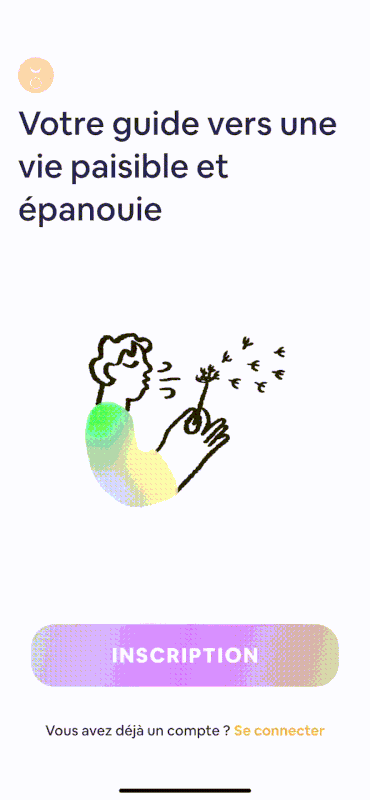

# 😁 flutter_login_funnel 👥

It's a **UX design** package to help you to build a login or register process quickly, simply and totaly responsive.
You can personnalize it by using your widget with the builder parameter but all the logic transition will be **auto manage**.
The transition is in FadeInOut for the label and the **keyboard doesn't change** when we change steps.
There is a  **progressbar** for the user to know when it's completed and a simple animation when the user start typing.

**This can be used with any Authentification service provider with email/password**

[](https://github.com/yelkamel/flutter_login_funnel)

All UX logic are tested with 100% of test coverage (run: flutter test).

## 😃 Import

```yaml
dependencies:
  flutter_login_funnel: ^0.0.8
  
or

  flutter_login_funnel:
    git:
      url: https://github.com/yelkamel/flutter_login_funnel
```

## 🧐 How to use

```Dart
 LoginFunnel(
      onFinish: (loginModel) {},
      onClose: () {},
      loadingWidget: const CircularProgressIndicator(),
      backWidget:  const Icon(Icons.arrow_back),
      onEmailValidation: (_) => _.length > 3,
      onPasswordValidation: (_) => _.length > 3,
      onNameValidation: (_) => _.length > 3,
      nextBuilder: (context, step, goNext) => MaterialButton(
        onPressed: goNext!,
        child: Text("Suivant"),
        ),
      titleBuilder: (context, step) {
        switch (step) {
          case LoginStep.name:
            return Text("votre prénom");
          case LoginStep.email:
            return Text("votre email ?");
          case LoginStep.pwd:
            return Text("mot de passe ?");
        }
      },
      registerOrConnectBuilder: (context, onRegister, onConnect) => Center(
        child: Column(
          children: [
            MaterialButton(
              onPressed: onConnect,
              child: Text("Click here to connect"),
            ),
            MaterialButton(
              onPressed: onRegister,
              child: Text("Click here to register"),
            ),
          ],
        ),
      ),
      actionsBuilder: (context, step, loginModel) => step == LoginStep.password ? 
            MaterialButton(
              onPressed: onConnect,
              child: Text("Reset Password request"),
            ) : const SizedBox();
      onAuthSubmit: (loginModel) async {
        if (!loginModel.createAccount) {
          final res = await Auth.signInWithEmailAndPassword(loginModel.email, loginModel.password);
          if (!res) return false;
        }
        final res = await Auth.registerWithEmailAndPassword(loginModel.email, loginModel.password);
        if (!res) return false;
        return true;
      },
    );
```


## 🤓 Reference

Property |   Type     | Description
-------- |------------| ---------------
onFinish |   `AuthCallback`     | <sub> When the the user is logged in If you use Auth stream strategy this is no needed. And It give the user login information (name, email, password, creationOrNot).</sub>
onAuthSubmit | `AuthCallback` | <sub>Where you have to call your Authentification service provider with the email/password (and name if it's a registration) if the provider doesn't accept you can return false to stop the tunnel otherwise true Tips: don't forget to popup a snackbar to explain why the provider didn't accepte.</sub>
onLogin |   `AuthCallback`     | <sub>Called when the user hit the submit button when in login mode.</sub>
onEmailValidation | `Function` | <sub>this validation function is to validate the email if it's return false it's will don't go next.</sub>
onPasswordValidation |   `Function`     | <sub>this validation function is to validate the password if it's return false it's will don't go next.</sub>
onNameValidation | `Function` | <sub>this validation function is to validate the name if it's return false it's will don't go next.</sub>
loadingWidget | `Widget` | <sub>This widget will be show when it's loading state.</sub>
backWidget | `Widget` | <sub>This widget will be show as back button.</sub>
titleBuilder | `Builder` | <sub>This will be show in the top for each step.</sub>
registerOrConnectBuilder | `Builder` | <sub>This will be show in the first step to as the use to connect or login use onConnect to call login and onRegister to register an user.</sub>
actionsBuilder | `Builder` | <sub>This is to build actions button for by step.</sub>
nextBuilder | `Builder` | <sub>This is to build the next button in the bottom of each step.</sub>
progressBarBuilder | `Builder` | <sub>This will show the progress of the funnel in the top for the user to know what's going on.</sub>


## 🙃 Model

LoginModel Data:

Property |   Type     | Description
-------- |------------| ---------------
createAccount |   `bool`     | <sub> A bool that contains if the user selected registration or connexion process.</sub>
name | `String` | <sub>The name getted from the funnel.</sub>
email |   `String`     | <sub>The email getted from the funnel.</sub>
password | `String` | <sub>The password getted from the funnel.</sub>


## 😎 Widget Utils

 LoginFunnelRegisterOrConnectWidgetUtils() 
 
 This widget is to show the first step of the funnel and let the choice of the user if he wanna to do a registration or a connexion.

  ```Dart
 LoginFunnelTopSectionWidgetUtils(  
            step: step,
            emailLabel: "Votre email ?",
            nameLabel: "Votre Prénom ?",
            passwordLabel: "Votre mot de passe ?",
            )
```

 LoginFunnelTopSectionWidgetUtils()

 This is a widget that show the label on top of the input for the step Name, Email or Password.

 ```Dart
 LoginRegisterOrConnectDefault(
            onLogin: onConnect,
            onRegister: onRegister,
            registerButtonLabel: "Inscription",
            alreadyAccountLabel: "Vous avez déjà un compte ?",
            connectButtonLabel: "Connexion",
          )
```

 LoginFunnelTopSectionWidgetUtils()

This is a simple progress bar widget that can be used in the login funnel.

 ```Dart
 LoginFunnelProgressBarWidgetUtils(
            step: step,
            progressColor: Colors.red,
            backgroundProgressColor:  Colors.blue,
          )
```

## 🥳 Idea Todo

Feature | Difficulty | Check
-------- |------------| ---------------
Authentification button for Fb, Google, Apple, etc.. |   🔥    | <sub> ☑️</sub>
Label input with microphone |  🔥🔥🔥  | <sub> ☑️ </sub>
Background image animation transition |   🔥🔥     | <sub> ☑️ </sub>
Onboarding process funnel classique | 🔥 | <sub> ☑️ </sub>
Making other animation transition like SlideInOut | 🔥 | <sub> ☑️ </sub>
Making other animation when user typing | 🔥 | <sub> ☑️ </sub>

**Feel free to add you idea to the README.**

## License

* MIT License

[example project]: example/lib/main.dart